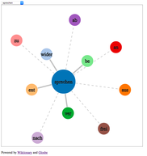

# German Verb Visualization

### Background
German is a language that is extremely compassable. Words are formed by combining existing  words. *Gehen* means "go," and related words are created by prepending prefixes. *Aufgehen* (literally *upgo*) means "rise", *umgehen* (literally *aroundgo*) means "circumnavigate", etc.

### Data format
Stored in Excel file with the following colums: verb, root, seperable?,
translations. Each translation is its own column so that there may be different
numbers of filled in columns per row. Seperable? must either be a y or an n.

Data must be exported to csv each time something is added
